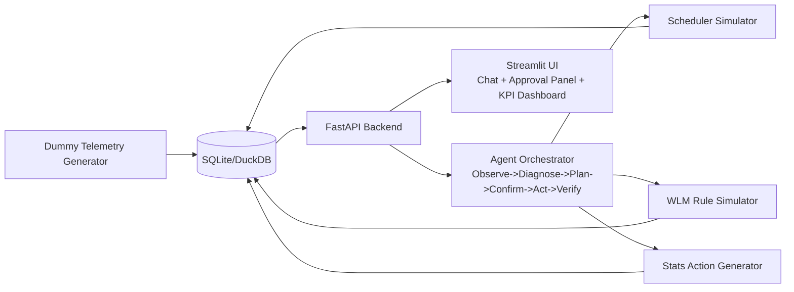

# Agentic Teradata Batch Optimization Demo Plan (Local Windows + VS Code)

## 1. Demo Objective
Build a local demo that mimics Teradata batch optimization for 30K+ jobs at small scale using synthetic telemetry.

The demo must complete an **agentic loop**:
1. Observe telemetry
2. Diagnose bottlenecks
3. Propose actions with impact estimates
4. Wait for user approval
5. Execute approved actions
6. Verify before/after impact
7. Propose next action if needed

## 2. MVP Scope
- 12-20 synthetic jobs across 3 domains: `INGEST`, `TRANSFORM`, `PUBLISH`
- 14 days of synthetic run history
- 3 action types:
  - Schedule shifts / dependency changes (simulated scheduler)
  - Stats collection actions (SQL generation; optional sandbox execution)
  - WLM throttling rule updates (simulated)
- Hard guardrails:
  - Human approval required before any action
  - Every action logged with rollback metadata

## 3. Local Architecture

## 4. Data Model (Synthetic, Teradata-like)
Create these tables:
- `demo_dbql_query_log`
  - `query_id, job_name, start_ts, end_ts, cpu_sec, io_mb, spool_mb, amp_skew_pct, sql_hash, query_band`
- `demo_resusage_hourly`
  - `hour_ts, cpu_pct, io_pct, spool_pct, active_sessions`
- `demo_job_runs`
  - `job_name, run_id, start_ts, end_ts, status, upstream_wait_sec`
- `demo_job_deps`
  - `parent_job, child_job`
- `demo_wlm_rules`
  - `rule_id, workload_class, concurrency_cap, active_window`
- `demo_actions_audit`
  - `action_id, proposed_action, approved_by, executed_ts, expected_impact, observed_impact, rollback_payload`

## 5. Injected Problems for the Demo
Include intentional issues so the agent has meaningful actions:
- One high-spool, high-skew transform job
- Two stale-stats candidates affecting join performance
- One artificially serialized dependency chain
- Concurrency spike at 01:00 for heavy jobs

## 6. Agent Decision Logic
Use a deterministic hybrid approach:
- Rule-based detectors (primary)
- LLM-generated explanation text (optional)

### Core rules
- `amp_skew_pct > 20` -> recommend PI/skew remediation candidate
- `spool_mb` above threshold -> recommend join redistribution review / throttling
- stale stats marker -> recommend `COLLECT STATISTICS`
- >N heavy jobs in same window -> recommend staggered start + concurrency cap
- non-critical dependency edge on critical path -> recommend dependency removal

## 7. User Experience Flow
1. User opens Streamlit UI and clicks **Load Baseline**.
2. User asks: "Analyze last 7 days and propose optimization plan."
3. Agent returns ranked actions with expected impact and risk.
4. User approves selected actions.
5. Agent executes actions via simulators and logs audit entries.
6. UI shows before/after KPIs and residual issues.

## 8. Implementation Plan (2 Weeks)

### Days 1-2
- Project scaffold (`backend`, `agent`, `ui`, `data`)
- Local DB schema + seed scripts

### Days 3-4
- Telemetry APIs + KPI endpoints
- DAG load and critical path analysis

### Days 5-6
- Rule engine for bottleneck detection
- Recommendation ranking with confidence score

### Days 7-8
- Agent orchestrator state machine
- Approval workflow contracts

### Days 9-10
- Execution adapters (scheduler/WLM/stats simulators)
- Audit + rollback logging

### Days 11-12
- Streamlit chat + approval + KPI dashboard
- Baseline vs after charts

### Days 13-14
- Demo script hardening
- Failure fallback paths and reset script

## 9. Local Runbook (Windows + VS Code)
1. Install Python 3.11+
2. Open folder in VS Code
3. Create virtual env and install requirements
4. Run DB seed script
5. Start backend API
6. Start Streamlit UI
7. Run demo script from `docs/demo-walkthrough.md`

## 10. Demo Success Metrics
- Batch window reduced by >=20% (simulated)
- Peak concurrency reduced by >=25%
- SLA misses reduced in replay window
- 100% executed actions have audit + rollback data

## 11. Stretch Enhancements
- Plug in masked sample extracts from non-prod Teradata DBQL
- Add simple cost model (`runtime * resource intensity`)
- Add scenario presets (`concurrency spike`, `skew hotspot`, `stale stats`)

